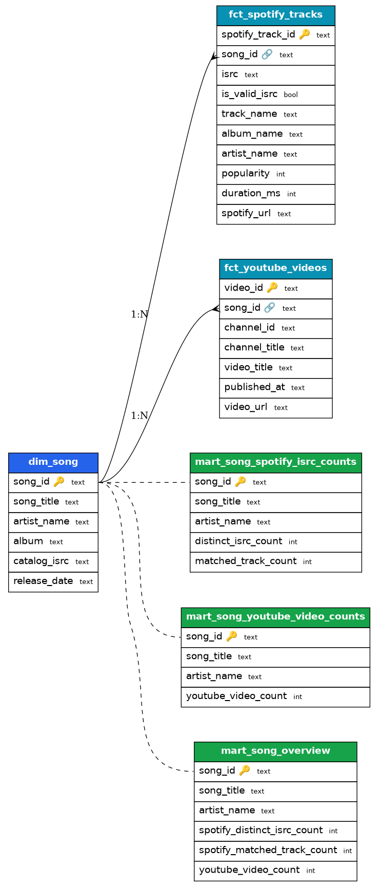

# MassiveMusic — DSP Metadata Pipeline

Automated pipeline that retrieves song/video metadata from **YouTube** and ISRCs
from **Spotify** (with an automatic free **MusicBrainz** fallback), transforms it
with **dbt**, and stores it in **PostgreSQL** so analysts can answer:

1. **How many videos does each song have on YouTube?**
2. **How many ISRCs does each song have on Spotify?**

Runs entirely on Docker. Orchestrated by Airflow (optional).

- Architecture & design: [`docs/architecture.md`](docs/architecture.md)
- Data model / ERD: [`docs/erd.md`](docs/erd.md) · 

## Prerequisites
- Docker Desktop running.
- (For real data) a YouTube Data API v3 key — free. Spotify Client ID/Secret is
  optional; if Spotify is unavailable the pipeline uses MusicBrainz for ISRCs.

## Quick start
```bash
cp .env.example .env          # then put your keys in .env (optional)
docker compose build
docker compose run --rm pipeline run-all
```
The last command extracts → loads → runs dbt → prints both business answers.
Re-running is safe (idempotent). If a source has no credentials/access it is
handled gracefully (mock for YouTube, MusicBrainz/empty for ISRCs) and the
pipeline still completes.

### Inspect results
```bash
docker compose exec postgres \
  psql -U warehouse -d warehouse -c \
  "SELECT * FROM marts.mart_song_overview ORDER BY youtube_video_count DESC;"
```

## ISRC source (Spotify vs MusicBrainz)
`ISRC_SOURCE` in `.env`: `auto` (default) uses Spotify when its credentials work,
otherwise the free MusicBrainz source. Force one with `musicbrainz` or `spotify`.
Since Feb 2026 Spotify requires the app owner to have Premium even for metadata;
`auto` falls back automatically so the pipeline never breaks.

## Optional: Airflow orchestration
```bash
docker compose --profile airflow up -d        # UI at http://localhost:8080
```
An **admin / admin** user is created automatically. Enable + trigger the
**`dsp_metadata_pipeline`** DAG; each stage runs the pipeline image as a
DockerOperator task.

## Individual stages
```bash
docker compose run --rm pipeline init
docker compose run --rm pipeline extract-catalog
docker compose run --rm pipeline extract-spotify
docker compose run --rm pipeline extract-youtube
docker compose run --rm pipeline dbt-build
docker compose run --rm pipeline show-results
```

## Teardown
```bash
docker compose --profile airflow down -v
```
