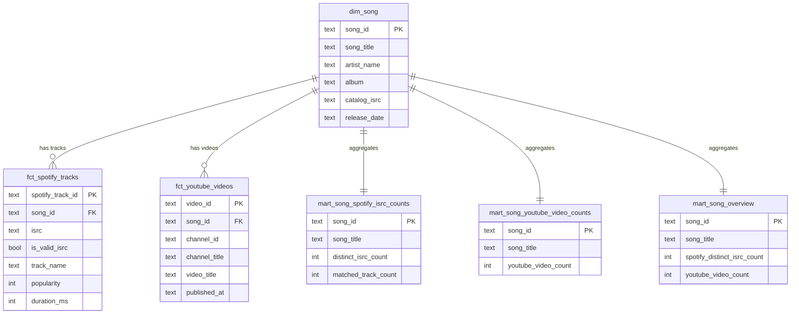

# Entity Relationship Diagram

The warehouse follows a **medallion** layout: `raw` (landing) → `staging`
(cleaned views) → `marts` (dimensional model + business answers). The diagram
below shows the modeled layer (`marts`). A rendered PNG is at
[`erd.png`](./erd.png).

## Grain & keys

| Table | Grain | Primary key |
|-------|-------|-------------|
| `dim_song` | one internal song | `song_id` |
| `fct_spotify_tracks` | one Spotify track matched to a song | `spotify_track_id` |
| `fct_youtube_videos` | one YouTube video matched to a song | `video_id` |
| `mart_song_spotify_isrc_counts` | one song | `song_id` |
| `mart_song_youtube_video_counts` | one song | `song_id` |
| `mart_song_overview` | one song | `song_id` |

The two business questions are answered directly by the two count marts;
`mart_song_overview` joins them for BI convenience.
